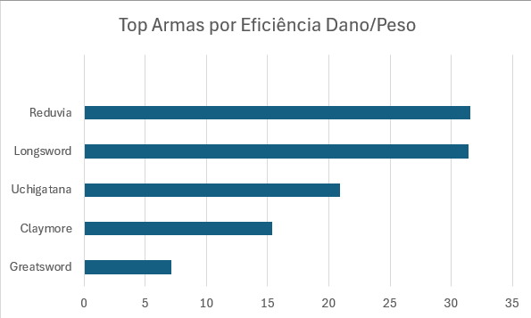
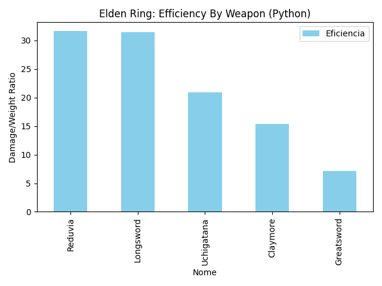

# Elden Ring Weapon Efficiency Analysis ⚔️

## 📌 Project Overview
This project analyzes the efficiency of starter weapons in Elden Ring, focusing on the **Damage-to-Weight ratio**. The goal is to identify which combat builds (Strength vs. Dexterity) offer the best performance for early-game players using three different professional approaches: Excel, SQL, and Python.

---

## 📊 Phase 1: Excel Analysis (Business Intelligence)
In the first phase, I used Excel to clean the data and create an initial dashboard. This demonstrates my ability to generate quick business insights and clear visualizations.

### Key Insights:
* **Reduvia** was identified as the most weight-efficient weapon.
* Used **Pivot Tables** to calculate the average efficiency per attribute.

  

---

## 🗄️ Phase 2: SQL Implementation (Data Engineering)
To show scalability, I migrated the dataset to a **SQLite** database using **DBeaver**. I wrote queries to perform the same calculations programmatically.

### Skills Demonstrated:
* Data Modeling (DDL): `CREATE TABLE`
* Data Manipulation (DML): `INSERT INTO`
* Advanced Querying: `GROUP BY`, `AVG`, and `ORDER BY`

sql
-- Query to calculate average efficiency by attribute
SELECT 
    atributo_principal,
    AVG(dano_base / peso) AS media_eficiencia
FROM armas
GROUP BY atributo_principal;

## 🐍 Phase 3: Python Automation (Data Science)

Finally, I developed a Python script using the Pandas library. This approach allows the analysis to be automated and scaled for thousands of weapons or different games with a single click.
Libraries Used:

    Pandas: For data manipulation and DataFrame structures.

    Matplotlib: To generate the automated bar chart.

  

🚀 Conclusion

This project demonstrates a full cycle of data analysis. I proved that regardless of the tool—be it a spreadsheet, a database, or a programming language—I can extract valuable insights and communicate them effectively in English, meeting international market standards.

Tools: Excel, SQL (SQLite), DBeaver, Python (Pandas/Matplotlib), VS Code.

## Author: Alecsander Gomes
